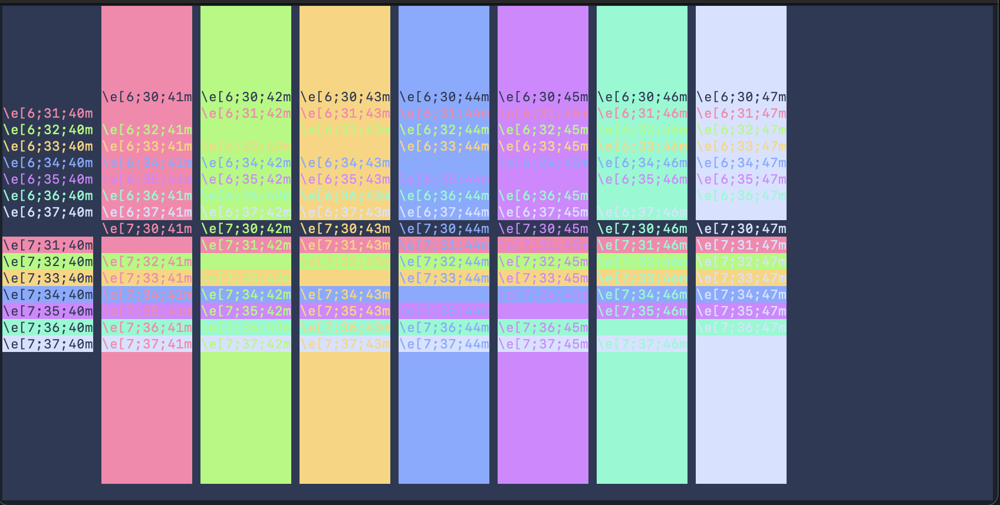
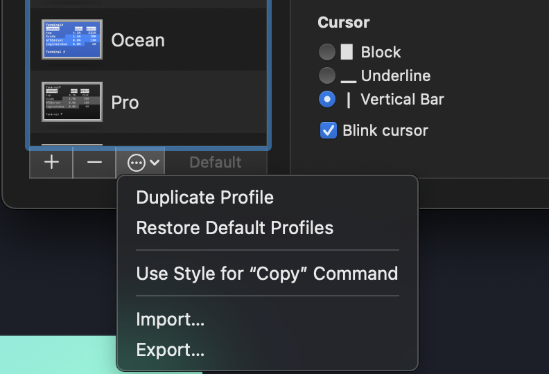

<p align="center"></p>

# Lapis Terminal App

A dark blue theme for Terminal.app.



# Installation

Either install using Git:

```
git clone https://github.com/aslbarnett/lapis-terminal-app.git
```
or download the zip.

1. Start Terminal.app and open 'Preferences'.
2. Click on 'Profiles'.
3. Click on the settings button (picture below).
4. Click 'Import...'.
5. Select the lapis.terminal file to import it.



# Feedback

If you see any issues with the theme, please [open an issue](https://github.com/aslbarnett/lapis-terminal-app/issues).
